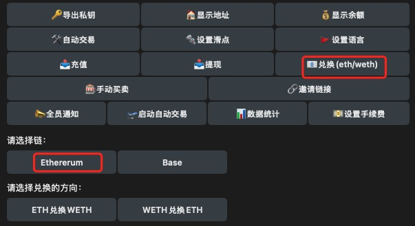

# 蜘蛛机器人使用手册

## 简介
蜘蛛机器人能够快速方便的交易Solana，Ethererum和Base链上的代币。   

机器人链接：https://t.me/spider_tge_sniper_bot   
社区链接：https://t.me/officialspider_bot     
联系人：https://t.me/Mark20172022   

## 亮点
低手续费：
Solana链上的交易手续费是1%，Ethererum和Base链上免手续费。

监测上币信息：   
机器人会随时监测Okx, Binance, Coinbase, Upbit交易所的上币信息并且将信息推送给用户。     

自动打新：   
机器人检测到Coinbase的上币信息之后，会在相应的链上自动购买该token。   

安全性：   
机器人会检测Solana代币的安全性，包括代币的冻结权限，修改权限。   

操作性：   
用户一次性设置打新配置后，无需干涉，机器人会自动买入代币并且通知用户。   
用户还可以通过UI一键手动买卖token。   

限价单(正在开发中)：
Solana链上代币，可以提前挂单交易。

## 使用说明
步骤：   
1. 通过/start开启机器人
2. 机器人会自动为用户生成Solana，Ethereum和Base的地址。     
3. 向地址充值SOL，ETH(ethereum)，ETH(Base)。   
4. 对机器人进行配置：设置滑点，语言。
5. 通过点击“手动买卖”按钮进行交易。
   
设置：
1. 滑点：默认滑点1%，该滑点对Solana生效。   
2. 语言：支持中英文。  

充值： 
 
1. 交易充值：
      
交易充值是给自己的地址充值，充值之后就可以进行交易。   

2. 财富密码：
   
向制定的地址充值成功之后，用户可以接收到监测交易所上币信息，并且可以开启自动打新功能。   

3. 新闻订阅： 
  
向制定的地址充值成功之后，用户可以配置接收新闻的群组，机器人会每个小时向制定的群组推送新闻。      
4. 账户升级：   

向制定的地址充值成功之后，用户可以升级为KOL，KOL交易免手续费，KOL邀请来的用户产生的手续费都会转移到KOL的账户中去。    
   
提现： 
   
用户可以提现主链币(SOL,ETH)和token。提现不收手续费。   

兑换：

用户可以使用该功能将ETH兑换为WETH或者将WETH兑换为ETH，Ethererum和Base链上兑换使用的是WETH。

交易：
   
上图是用户手动交易，需要选择链，输入代币合约地址，交易数量。   

上图自动打新交易，打新成功之后，机器人会自动将交易信息推送给用户。

